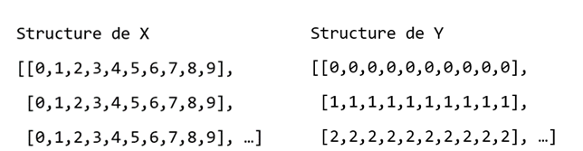
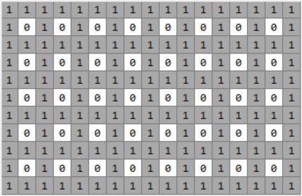
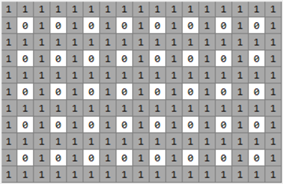
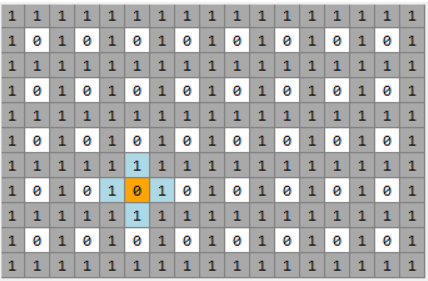
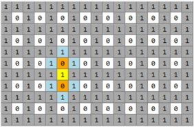
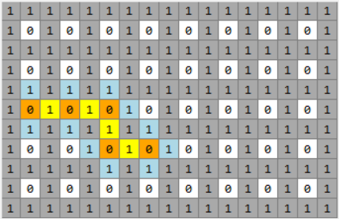
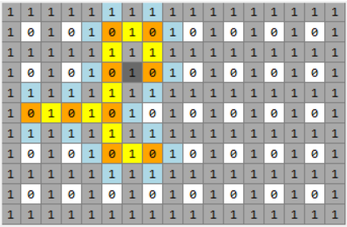
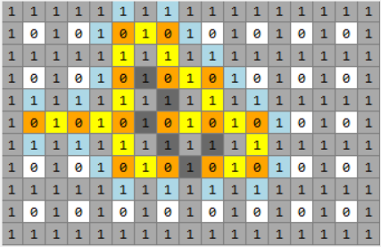

## Fonction `Create_walls` : Génération des murs aléatoires

Cette fonction est définie dans le classe Board permettant de générer aléatoirement des murs, elle est basée sur l’algorithme de Prim.  

     `def create_walls(self):
          # GENERATING RANDOM WALLS

          def allow_visit(j, i):
              return (
                  j not in [0, self.game.height - 1]
                  and i not in [0, self.game.width - 1]
                  and (j, i)
                  not in [to_visit_cood for to_visit_cood, parent_cood in to_visit]
                  and (j, i) not in visited_path
              )

          def mark_to_visit(j, i):
              for adj_coord in [(j + 1, i), (j - 1, i), (j, i + 1), (j, i - 1)]:
                  if allow_visit(*adj_coord):
                      to_visit.append((adj_coord, (j, i)))

          X, Y = np.meshgrid(np.arange(self.game.width), np.arange(self.game.height))
          self.walls = (X % 2 == 0) | (Y % 2 == 0)

          while True:
              begin_j, begin_i = np.random.randint(
                  0, self.game.height
              ), np.random.randint(0, self.game.width)
              if begin_j % 2 and begin_i % 2:
                  break
              print(begin_j, begin_i)
          visited_island = {(begin_j, begin_i)}
          visited_path = set()
          to_visit = []
          mark_to_visit(begin_j, begin_i)
          while to_visit:
              (visiting_cood, parent_cood) = to_visit.pop(
                  np.random.randint(len(to_visit))
             )
              visiting_j, visiting_i = visiting_cood
              detect_j, detect_i = np.array(visiting_cood) * 2 - np.array(parent_cood)
              visited_path.add(visiting_cood)
              if (detect_j, detect_i) not in visited_island:
                  self.walls[detect_j, detect_i] = 0
                  self.walls[visiting_j, visiting_i] = 0
              visited_island.add((detect_j, detect_i))
            mark_to_visit(detect_j, detect_i)`
            
***

Dans la fonction, on définit aussi la fonction `allow_visit` et `mark_to_visit` :
- `allow_visit` :   
Cette fonction est utilisée pour vérifier si une coordonnée `(j, i)` peut être accessible. Plus précisément, elle vérifie si la coordonnée se trouve sur le bord de la carte, si elle est déjà dans la liste `to_visit` et si elle a déjà été visitée auparavant. Si la coordonnée peut être visitée, la fonction renvoie `True`, sinon elle renvoie False. Dans le processus de génération de la carte, cette fonction est utilisée pour déterminer s'il faut ajouter la coordonnée à la liste `to_visit`.
- `mark_to_visit` :  
Cette fonction ajoute les positions accessibles environnantes à la liste to_visit et enregistre la position actuelle `(j, i)` comme leur nœud parent. Cette fonction fait partie de l'algorithme de recherche utilisé pour générer les murs.  
Plus précisément, pour la position actuelle `(j, i)`, le code parcourt les quatre positions adjacentes dans les directions haut, bas, gauche et droite, et utilise la fonction `allow_visit(*adj_coord)` pour déterminer si la position peut être accédée. Si c'est le cas, le tuple `(adj_coord, (j, i))` composé de la position `(adj_coord)` et de la position actuelle `(j, i)` est ajouté à to_visit. Ici, `(j, i)` est enregistré comme le nœud parent de `(adj_coord)`, ce qui peut être utilisé plus tard pour reconstruire le chemin.  

### Algorithme principal :  

    X, Y = np.meshgrid(np.arange(self.game.width), np.arange(self.game.height))
    self.walls = (X % 2 == 0) | (Y % 2 == 0)
    
Ce code utilise la fonction meshgrid de la bibliothèque `Numpy` pour créer deux tableaux bidimensionnels `X` et `Y`, qui représentent les valeurs de coordonnées dans les directions horizontale et verticale, respectivement. Les formes de `X` et `Y` sont toutes deux `(h, w)`, c'est-à-dire h lignes et w colonnes. Ici, h et w représentent respectivement la hauteur et la largeur du labyrinthe.
  
L'instruction suivante, `(X % 2 == 0) | (Y % 2 == 0)`, effectue une opération logique OU élément par élément sur ces deux tableaux pour obtenir un tableau booléen qui représente les positions qui doivent être définies comme obstacles. Pour un point `(i, j)` sur le plan bidimensionnel, si ses coordonnées horizontale et verticale sont toutes deux paires, alors il s'agit d'un mur dans le labyrinthe. Par conséquent, le code génère des obstacles dans le labyrinthe de cette manière suivante :

     *Les 1 : Des murs* 

    

     *Les 0 : Des espaces accessibles* 

    

     *Les bords comprennent que des 1.* 

  

     *Les 0 sont entournés par les 1.*

   

  

  
     
***

          while True:
              begin_j, begin_i = np.random.randint(
                  0, self.game.height
              ), np.random.randint(0, self.game.width)
              if begin_j % 2 and begin_i % 2:
                  break
              print(begin_j, begin_i)
          visited_island = {(begin_j, begin_i)}
          visited_path = set()
          to_visit = []  
          
Ce code fait l’initiation pour démarrer la boucle qui génère des murs :  
- La boucle While génère une position initiale `(begin_j, begin_i)` qui est assurée grâce à la boucle d’être située à la position dont la valeur corresponde est `0` (l’espace accessible).  
- Création d’un dictionnaire `visited_island` pour enregistrer des points (islands) parcourus. Le premier élément dedans est donc le point de départ `(begin_j, begin_i)`.  
- Création d’un ensemble vide `visited_path` pour enregistrer des chemins entre des islands.  
- Création d’une liste vide `to_visit` pour enregistrer des points suivants à parcourir.   

***

          while to_visit:
              (visiting_cood, parent_cood) = to_visit.pop(
                  np.random.randint(len(to_visit))
             )
              visiting_j, visiting_i = visiting_cood
              detect_j, detect_i = np.array(visiting_cood) * 2 - np.array(parent_cood)
              visited_path.add(visiting_cood)
              if (detect_j, detect_i) not in visited_island:
                  self.walls[detect_j, detect_i] = 0
                  self.walls[visiting_j, visiting_i] = 0
              visited_island.add((detect_j, detect_i))
            mark_to_visit(detect_j, detect_i)  
    
Ce code réalise les étapes répétitives pour que toutes les positions sur la carte soient traitées :  
- Sélectionner de manière aléatoire une position `(visiting_cood, parent_cood)` dans la liste des positions à visiter. `visiting_cood` représente la coordonnée de la position actuelle et `parent_cood` représente la coordonnée de son noeud parent.  
- Marquer la position actuelle comme visitée et l'ajouter au chemin de visite déjà parcouru `visited_path`.  
- Vérifier s'il existe un obstacle entre la position actuelle visiting_cood et son noeud parent parent_cood. Si tel est le cas, supprimer l'obstacle (en position `detect_j, detect_i`) en définissant `self.walls[detect_j, detect_i]` et `self.walls[visiting_j, visiting_i]` à `0`, et marquer `(detect_j, detect_i)` comme visité.  
- Ajouter à la liste des positions à visiter toutes les positions voisines non visitées de la position actuelle, et marquer leur noeud parent comme la coordonnée de la position actuelle (fonction `mark_to_visit`).  
*A noter que* quel que soit la position de `visiting_cood` par rapport au `parent_cood`, ces trois positions traitées dans une opération vérifient (réalisé par `detect_j, detect_i = np.array(visiting_cood) * 2 - np.array(parent_cood))` :   

| `parent_cood` | `visiting_cood` | `detect_j,i` |   
|     :----:    |      :----:     |    :----:    |   

  

***

*Voici une visualisation simple décrivant une première opération de l’algorithme : *  

  

  

*Cet algorithme finit quand il n'y a plus de blocs bleus dans le labyrinthe.*  
*Et les blocks jeunes et oranges deviennet des chemins accessibles.*

          

